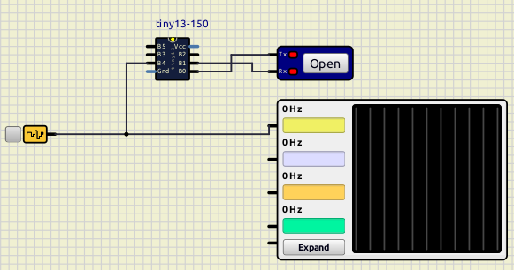
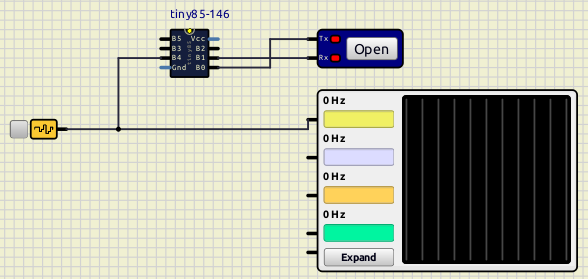

# DSBI Transmitter firmware for attiny13/x5
This code is for AVR(R) attiny13/x5. Firmware was tested with
simulide and simulavr.
It samples EEG data with oversampling, and results are sent 512 times in second.
## Simplified schematic
```
                           ____
                   B5/RST |    | VCC
                       B3 |    | PB2         __________
EEG ==> AMPLIFIER ==>  B4 |    | PB1 ==> RX | UART     |
                      GND |____| PB0 <== TX |19200 b/s |
                                            |__________|
```
## Data format
```
data[]={ 0b10HHHHH, 0b01LLLLL }
H - High (MSB)
L - Low (LSB)
```
## Usage
To aqcuire data use [QBrainwaveOSC](https://github.com/donarturo11/QBrainwaveOSC).
The simple circuits for attiny13 and attiny85 are in simulide directory and can be opened with
[SimulIDE](https://simulide.com/p/).
## Simulide



